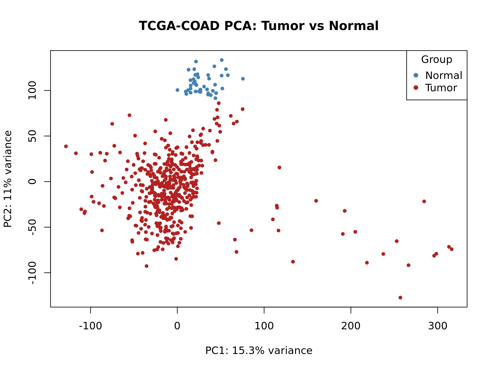
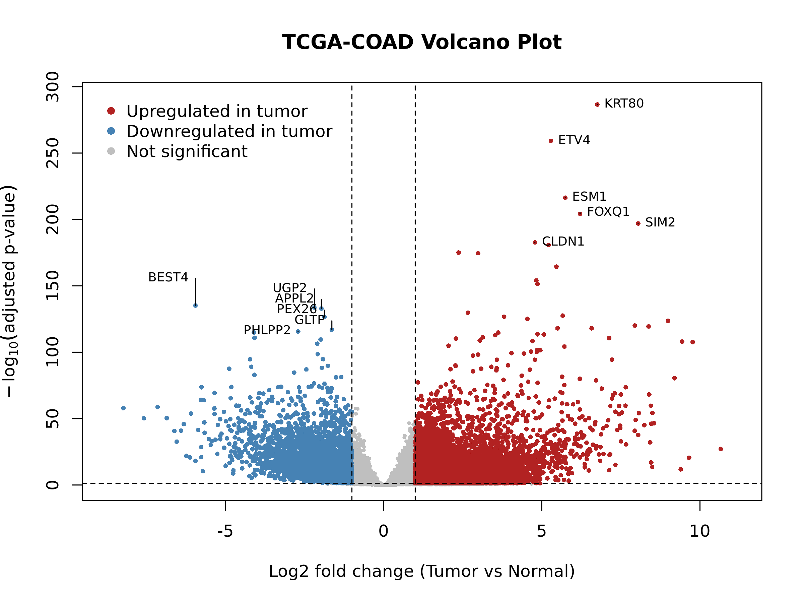
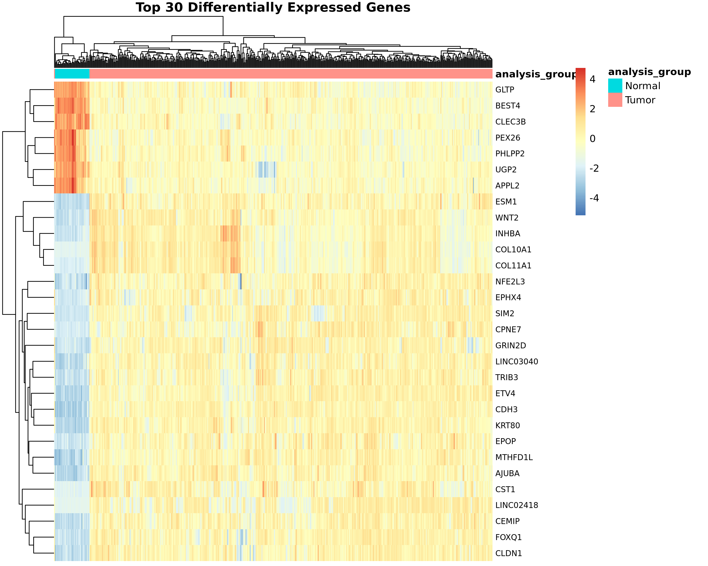

# TCGA-COAD Bulk RNA-seq Differential Expression Analysis

A reproducible downstream bulk RNA-seq analysis of TCGA colon adenocarcinoma (TCGA-COAD) to identify transcriptomic differences between tumor and normal samples using DESeq2 in R.

## Overview
This project explores gene expression differences between colon adenocarcinoma tumor samples and normal colon samples from TCGA-COAD. The workflow was designed as a portfolio project to demonstrate practical skills in human cancer transcriptomics, RNA-seq data handling, differential expression analysis, result visualization, and biological interpretation.

## Project objective
The main objective of this project is to identify differentially expressed genes between tumor and normal colon samples and summarize the resulting transcriptomic patterns through a clear and reproducible workflow.

## Dataset
- **Source:** TCGA-COAD
- **Data type:** Bulk RNA-seq gene expression data
- **Comparison:** Tumor vs normal samples

## Analysis design
The analysis was performed on:
- **522 samples in total**
- **481 tumor samples**
- **41 normal samples**

Raw count data were retrieved using `TCGAbiolinks`, filtered for tumor-vs-normal comparison, and analyzed with `DESeq2`.

## Tools and packages
- R
- TCGAbiolinks
- SummarizedExperiment
- DESeq2
- dplyr
- pheatmap
- AnnotationDbi
- org.Hs.eg.db

## Workflow
1. Download TCGA-COAD RNA-seq count data and metadata
2. Prepare tumor-vs-normal sample metadata
3. Run differential expression analysis with DESeq2
4. Generate PCA, volcano plot, MA plot, and heatmap
5. Annotate top genes and summarize key findings

## Key results
- PCA showed a clear separation between tumor and normal colon samples.
- Tumor samples displayed greater heterogeneity than normal samples.
- Differential expression analysis identified widespread transcriptomic differences between the two groups.
- **32,040 genes** were tested after filtering.
- **23,544 genes** were significant at `padj < 0.05`.
- The top differentially expressed genes were sufficient to visually separate most tumor and normal samples in the heatmap.

## Selected figures

### PCA: tumor vs normal separation
The PCA shows a clear separation between tumor and normal colon samples, with tumor samples displaying greater heterogeneity.

### Volcano plot: global differential expression pattern
The volcano plot highlights widespread transcriptomic differences between tumor and normal samples, with both strongly upregulated and downregulated genes.

### Heatmap: top differentially expressed genes
The top differentially expressed genes are sufficient to visually separate most tumor and normal samples.

## Main result file
- `results/tcga_coad_top30_heatmap_genes.csv`

## Repository structure
- `data/` — locally generated input data and metadata files
- `scripts/` — analysis scripts
- `results/` — lightweight summary result files
- `figures/` — plots generated from the analysis

## Notes on data storage
Large downloaded and generated data files are kept locally and are not tracked in GitHub in order to keep the repository lightweight and reproducible.

To regenerate the data and results, run the scripts in order from the project root.

## Scripts
- `scripts/01_download_tcga_coad_data.R`
- `scripts/02_prepare_metadata.R`
- `scripts/03_deseq2_analysis.R`
- `scripts/04_visualization.R`
